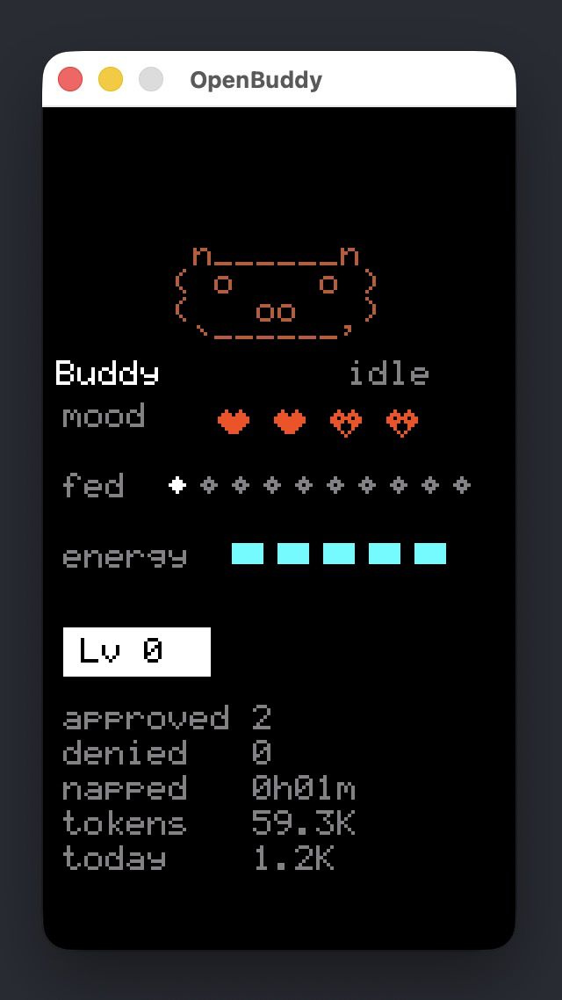

# OpenBuddy

Desktop companion for [OpenCode](https://opencode.ai), ported from [claude-desktop-buddy](https://github.com/anthropics/claude-desktop-buddy) — an M5StickC firmware pet that reacts to your coding sessions. Runs as a native SDL3 window, connected via TCP to an OpenCode plugin.

The original buddy communicates with Claude Desktop over Bluetooth Serial — a bidirectional byte stream. We preserve the same wire protocol over TCP, so the buddy remains protocol-compatible with the upstream firmware.



## Quick Start

### 1. Install the plugin

The plugin is a single TypeScript file that OpenCode loads directly.

Install for your **project** (per-session):

```sh
mkdir -p .opencode/plugins
cp plugin/openbuddy.ts .opencode/plugins/
```

Or install **globally** (all sessions):

```sh
mkdir -p ~/.config/opencode/plugins
cp plugin/openbuddy.ts ~/.config/opencode/plugins/
```

### 2. Build and run the buddy

```sh
./build-buddy.sh
```

This checks for dependencies (`cmake`, `sdl3`, `nlohmann-json`, `asio`) and builds the binary. If anything is missing, it prints the install command.

Run it:

```sh
./start-buddy.sh
```

### Keys

| Key | Action |
|-----|--------|
| `A` | Toggle info page |
| `D` | Toggle pet page |
| `W` | Next species |
| `S` | Previous species |
| `Y` | Approve permission prompt |
| `N` | Deny permission prompt |
| `H` | Toggle help overlay |
